# SpringVulnBoot Backend

## 1、项目介绍

基于 Vue + SpringBoot 构建的 Java 安全靶场，一个专为安全爱好者、渗透测试和代码审计人员打造的实战演练平台。

1、前端是基于流行的vue-admin-template基础模板进行改改改，[前端工程](https://github.com/bansh2eBreak/SpringVulnBoot-frontend)
2、后端是基于SpringBoot 2.7.14开发的，[后端工程](https://github.com/bansh2eBreak/SpringVulnBoot-backend)

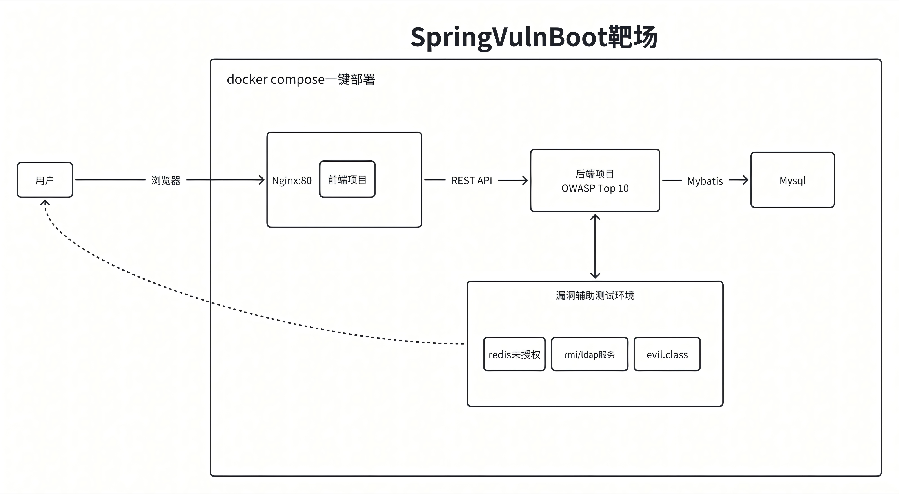

## 2、快速开始

### 2.1、前置条件

- Docker
- Docker Compose
- Docker镜像加速
- Git

### 2.2、安装步骤

1、克隆前后端项目到同级目录

```bash
# 创建项目目录
mkdir SpringVulnBoot && cd SpringVulnBoot

# 克隆前端项目
git clone https://github.com/bansh2eBreak/SpringVulnBoot-frontend.git

# 克隆后端项目
git clone https://github.com/bansh2eBreak/SpringVulnBoot-backend.git
```

2、启动服务

```bash
# 进入后端项目目录
cd SpringVulnBoot-backend

# 启动所有服务
docker compose up -d
```

3、访问服务

- 前端页面：http://localhost
- 后端API：http://localhost:8080
- MySQL数据库：localhost:13306

4、注意

- ⚠️禁止将靶场部署在生产环境，以免被恶意利用
- 经过测试，容器方式部署，里面的路径穿越漏洞暂不支持，待优化
  
## 3、已实现的漏洞

- SQLi注入
  - 基于Jdbc的SQLi注入
  - 基于Mybatis的SQLi注入
  - 报错注入
- XSS跨站脚本
  - 反射型XSS
  - 存储型XSS
- 任意命令执行
  - Runtime方式
  - ProcessBuilder方式
- 任意URL跳转
- 路径穿越漏洞
- 文件上传漏洞
- 越权漏洞
  - 水平越权漏洞
  - 垂直越权漏洞
  - 未授权访问漏洞
- 身份认证漏洞
  - 密码登录暴力破解
    - 普通的账号密码登录暴力破解
    - 绕过单IP限制暴力破解
    - HTTP Basic认证登录暴力破解
    - 图形验证码登录暴力破解
  - 短信认证漏洞
    - 短信轰炸
    - 短信验证码回显
    - 暴力破解短信验证码
- 组件漏洞
  - Fastjson漏洞
  - Log4j2漏洞
- 配置漏洞
  - 列目录漏洞
  - Actuator未授权

## 4、效果图展示

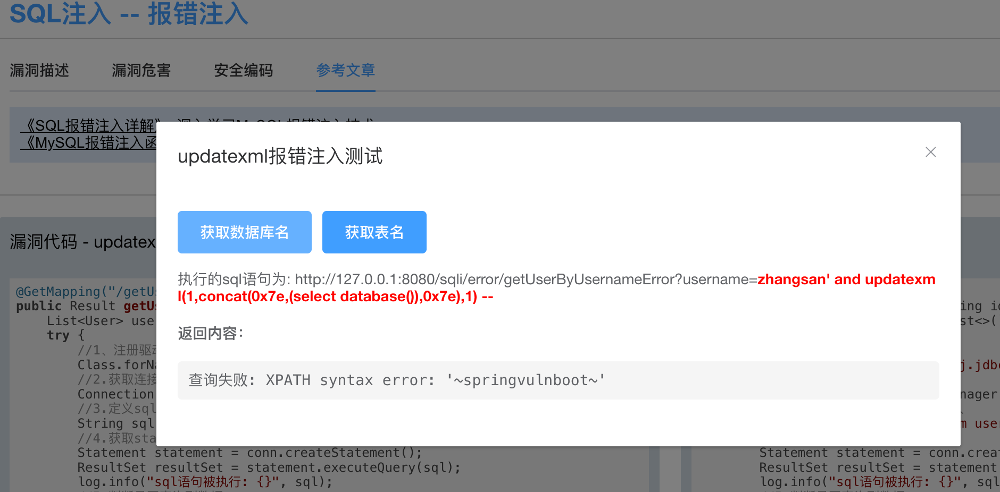
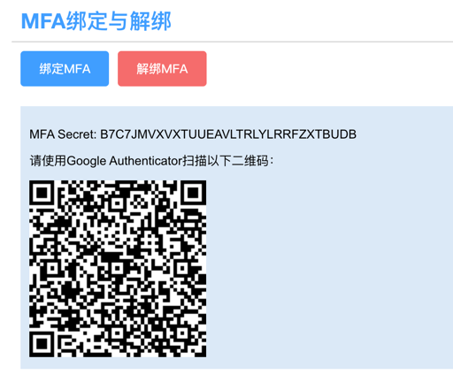
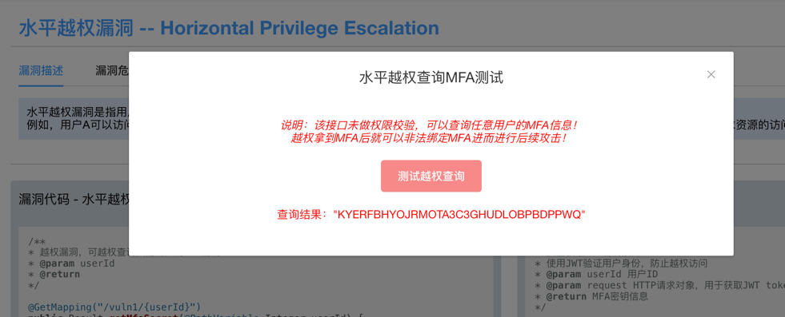
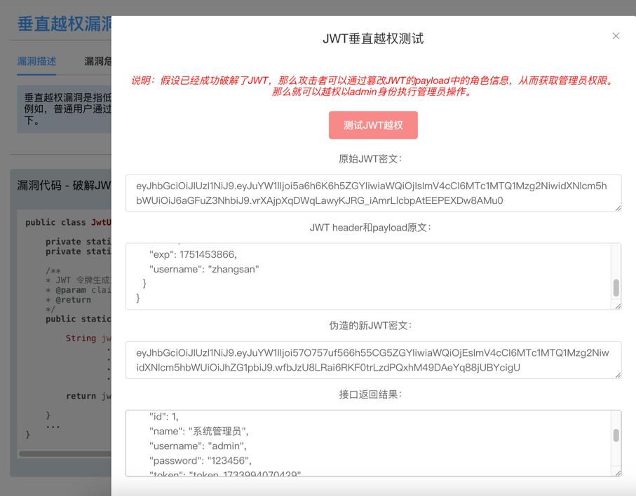
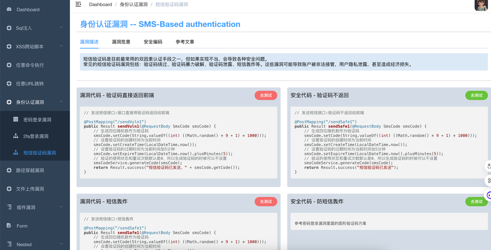
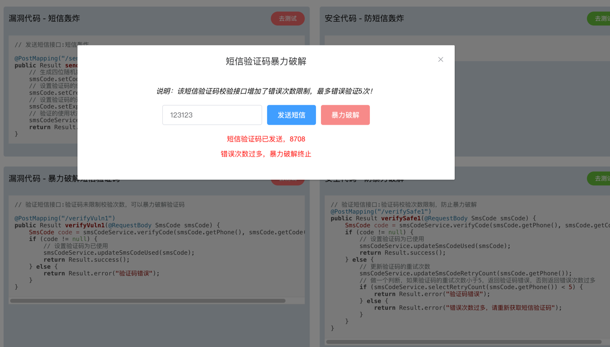
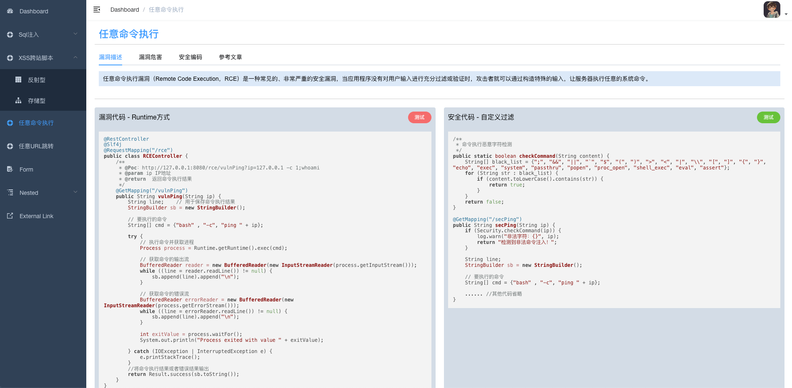
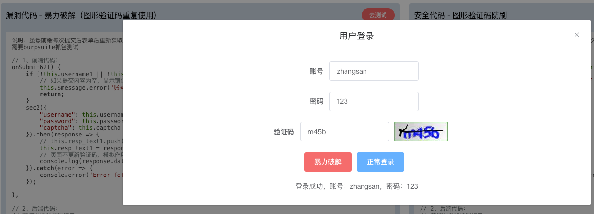

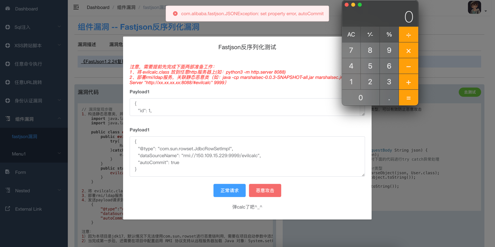
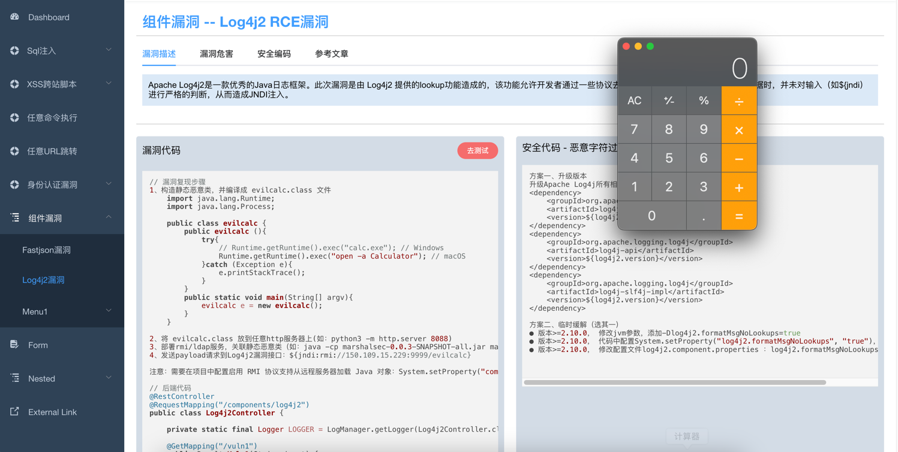
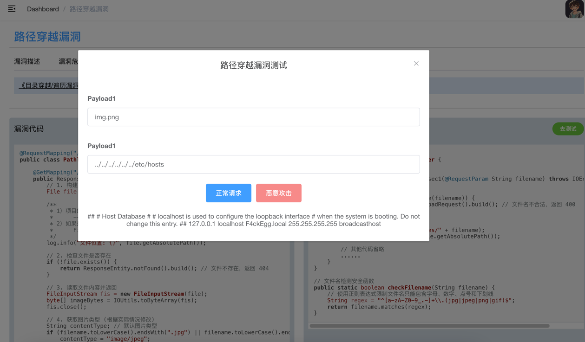
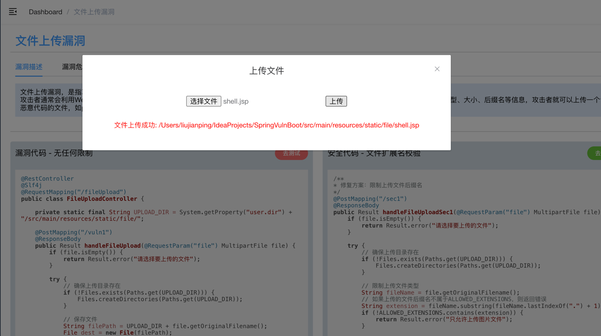
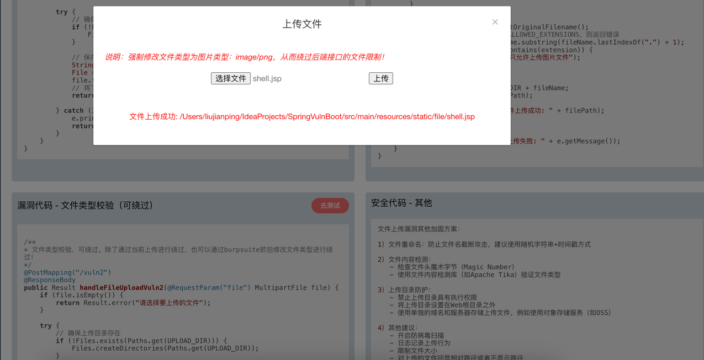
