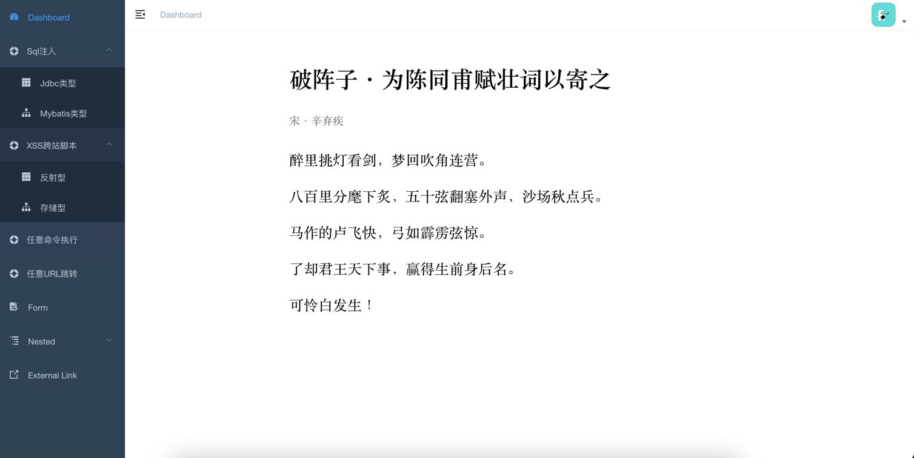

Java靶场 -- SpringVulnBoot

通过Springboot打造的java安全靶场，尽可能编写出各种常见的漏洞，供大家学习和测试。前端是通过流行的vue-admin-template基础模板进行开发，后端是通过Springboot进行开发。

当前项目包含的漏洞有：
- SQLi注入
- XSS跨站脚本
- 任意命令执行
- 任意URL跳转

后续会继续更新其他漏洞，欢迎大家提供更多的漏洞案例，包括不限于：
- 文件上传漏洞
- SSRF漏洞
- CSRF漏洞
- 逻辑漏洞
- 业务漏洞
- ...

