# SpringVulnBoot Backend

## 1、项目介绍

基于 Vue + SpringBoot 构建的 Java 安全靶场，一个专为安全爱好者、渗透测试和代码审计人员打造的实战演练平台。

[前端工程](https://github.com/bansh2eBreak/SpringVulnBoot-frontend)是基于流行的vue-admin-template基础模板进行改改改，[后端工程](https://github.com/bansh2eBreak/SpringVulnBoot-backend)是基于JDK11+SpringBoot 2.7.14开发的。

支持 **admin** 和 **guest** 两种角色，菜单与接口均实现权限隔离，可用于模拟不同权限等级的攻击场景。

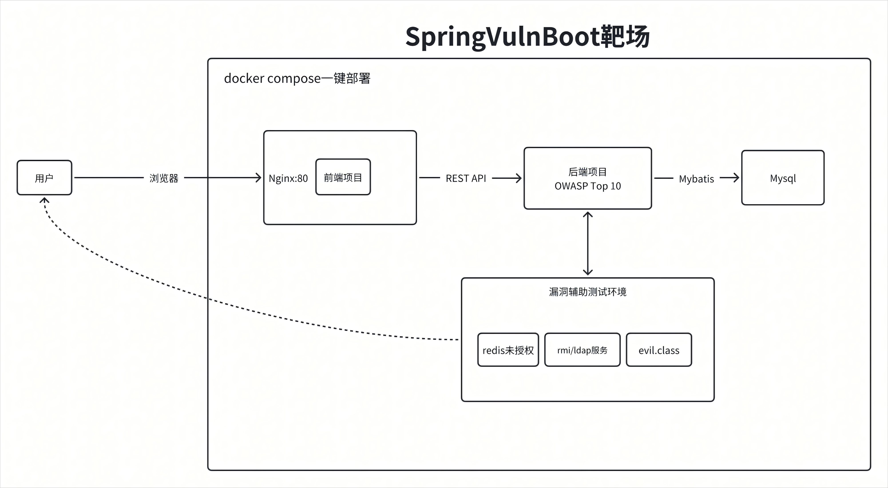

## 2、快速开始

### 2.1、前置条件

- Docker
- Docker Compose
- Docker镜像加速
- Git

### 2.2、安装步骤

提供两种部署方式，按需选择：

| 方式 | 适合场景 | 耗时 |
|------|---------|------|
| **方式一：预构建镜像（推荐）** | 快速体验，无需本地编译 | 快（仅下载镜像） |
| **方式二：源码构建** | 需要修改源码、二次开发 | 慢（需编译 Java + 打包前端） |

---

#### 方式一：预构建镜像部署（推荐）

前后端镜像已通过 GitHub Actions 自动构建并发布至 GitHub Container Registry，直接拉取即可，**无需本地安装 JDK、Maven、Node.js 等工具链**。

1、克隆后端项目（仅需后端仓库，用于获取配置文件）

```bash
git clone https://github.com/bansh2eBreak/SpringVulnBoot-backend.git
cd SpringVulnBoot-backend
```

2、启动所有服务（镜像自动从 ghcr.io 拉取）

```bash
docker compose -f docker-compose.prebuilt.yml up -d
```

3、访问服务

- 前端页面：[http://localhost](http://localhost)
- 后端API：[http://localhost:8080](http://localhost:8080)

4、更新到最新版本

```bash
docker compose -f docker-compose.prebuilt.yml pull
docker compose -f docker-compose.prebuilt.yml up -d
```

---

#### 方式二：源码构建部署

从源码构建可完整定制代码，适合二次开发或代码审计学习。

1、克隆前后端项目到同级目录

```bash
# 创建项目目录
mkdir SpringVulnBoot && cd SpringVulnBoot

# 克隆前端项目
git clone https://github.com/bansh2eBreak/SpringVulnBoot-frontend.git

# 克隆后端项目
git clone https://github.com/bansh2eBreak/SpringVulnBoot-backend.git
```

2、启动服务（首次启动需下载依赖并编译，耗时较长）

```bash
# 进入后端项目目录
cd SpringVulnBoot-backend

# 构建镜像并启动所有服务
docker compose up -d
```

3、访问服务

- 前端页面：[http://localhost](http://localhost)
- 后端API：[http://localhost:8080](http://localhost:8080)

---

4、注意

- ⚠️禁止将靶场部署在生产环境，以免被恶意利用
- ⚠️严禁利用本靶场技术和工具对未授权的网站或系统进行非法攻击，否则后果自负

### 2.3、更新步骤

> **为什么更新时需要重建数据库 Volume？**
>
> MySQL 容器通过 `docker-entrypoint-initdb.d/` 目录中的 `db.sql` 来初始化数据库，但该初始化脚本**只在数据目录为空时执行一次**。由于项目使用了具名 Volume（`mysql-data`）持久化数据，容器重启后 MySQL 检测到数据目录已存在，会直接跳过初始化脚本。
>
> 因此，当靶场版本更新涉及数据库结构变更（新增表、修改字段等）时，**必须先删除旧的 Volume**，让 MySQL 重新执行最新的 `db.sql`。

```bash
# 进入后端项目目录
cd SpringVulnBoot-backend

# 拉取最新代码
git pull

# 1. 停止并删除所有容器及 Volume（⚠️ 会清空数据库数据）
docker compose down -v

# 2. 重新构建镜像并启动（MySQL 会自动执行最新的 db.sql）
docker compose up -d --build
```

> 💡 如果不想丢失数据库中的自定义数据，也可以手动进入 MySQL 容器执行增量 SQL：
>
> ```bash
> docker exec -it springvulnboot-mysql mysql -uroot -pRoot1234 SpringVulnBoot
> # 然后手动执行 db.sql 中新增的建表/插入语句
> ```

## 3、已实现的漏洞

- SQLi注入
  - 基于Jdbc的SQLi注入
  - 基于Mybatis的SQLi注入
  - Order by注入
  - 报错注入
  - 基于时间盲注
  - 布尔注入
  - UNION联合注入
  - 二次注入
- XSS跨站脚本
  - 反射型XSS
  - 存储型XSS
  - DOM型XSS
- CSRF跨站请求伪造
- 任意命令执行
  - Runtime方式
  - ProcessBuilder方式
- 批量赋值漏洞
- GraphQL漏洞
  - GraphQL字段泄漏
  - GraphQL越权查询
  - GraphQL SQL注入漏洞
- 任意URL跳转
- 路径穿越漏洞
- 文件上传漏洞
- 文件包含漏洞
- 反序列化漏洞
- XML安全漏洞
  - XML外部实体注入
  - XPath注入
  - XML 炸弹漏洞
  - SSRF via XXE
  - Xinclude注入
- 越权漏洞
  - 水平越权漏洞
  - 垂直越权漏洞
  - 未授权访问漏洞
- 身份认证漏洞
  - 密码登录暴力破解
    - 普通的账号密码登录暴力破解
    - 绕过单IP限制暴力破解
    - HTTP Basic认证登录暴力破解
    - 图形验证码登录暴力破解
  - 短信认证漏洞
    - 短信轰炸
    - 短信验证码回显
    - 暴力破解短信验证码
  - MFA 认证漏洞
    - 仅前端认证可绕过
- JWT安全漏洞
  - JWT弱密码
  - JWT存储敏感信息
  - JWT None算法漏洞
  - JWT 算法混淆漏洞
- 组件漏洞
  - Fastjson漏洞
  - Log4j2漏洞
  - SnakeYAML漏洞
  - XMLDecoder漏洞
  - Shiro-550漏洞
  - XStream漏洞
  - Jackson漏洞
- 配置漏洞
  - 列目录漏洞
  - Actuator未授权
  - Swagger未授权
- 其他漏洞
  - 正则拒绝服务漏洞
  - IP地址伪造
  - SpEL表达式注入漏洞
  - 科学计数法DoS
  - LDAP注入

## 4、效果图展示

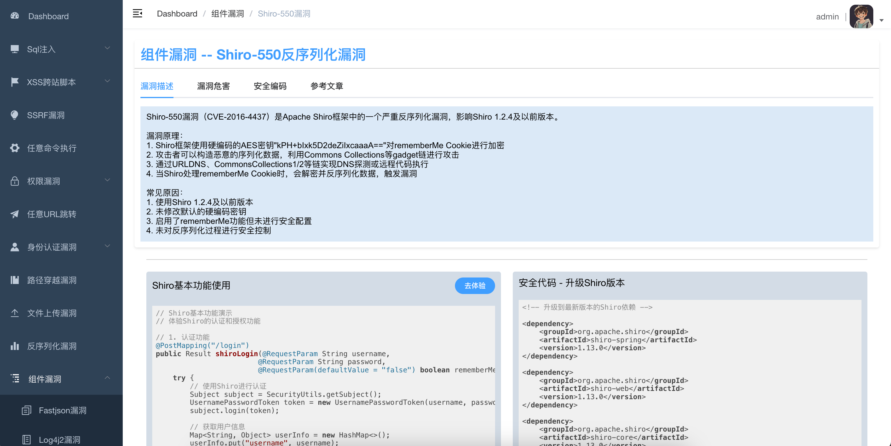
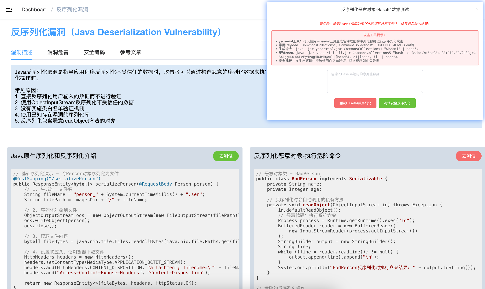
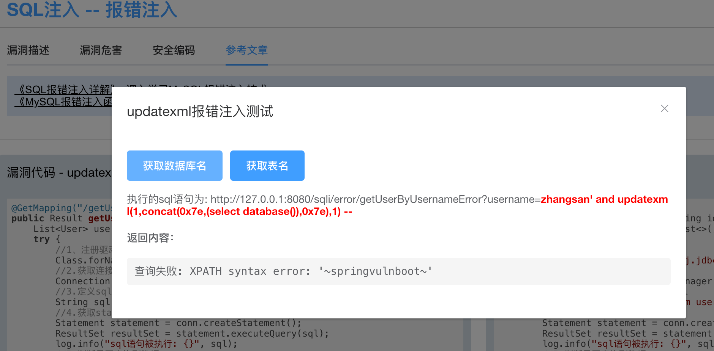
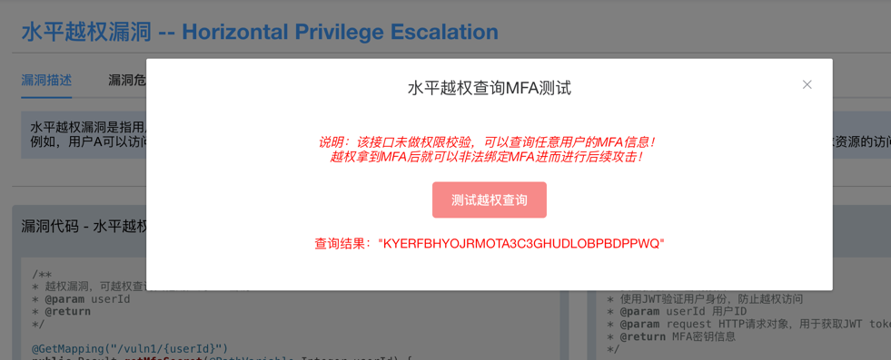
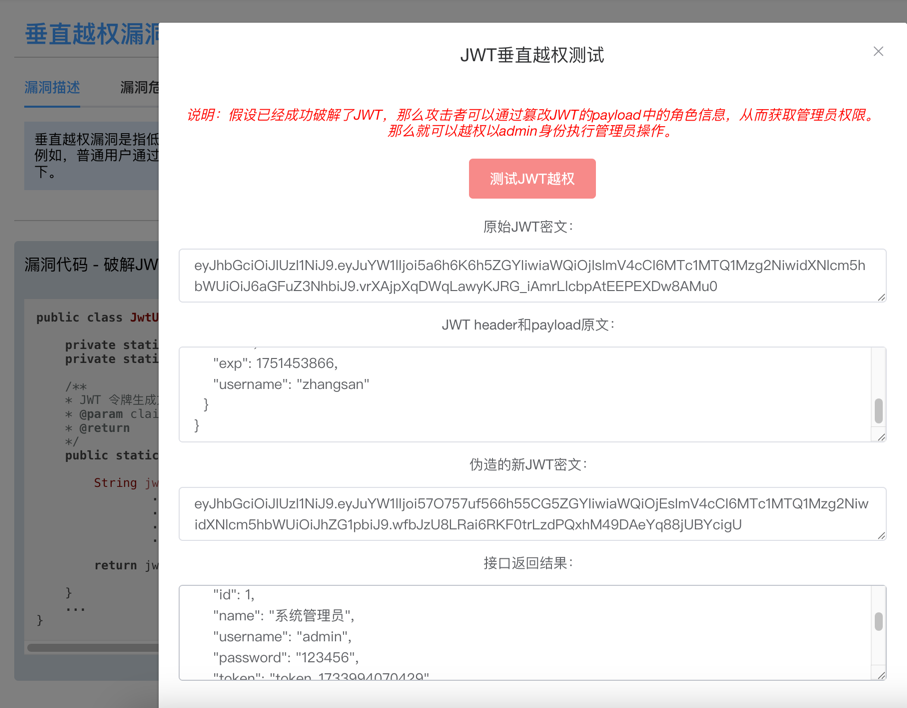
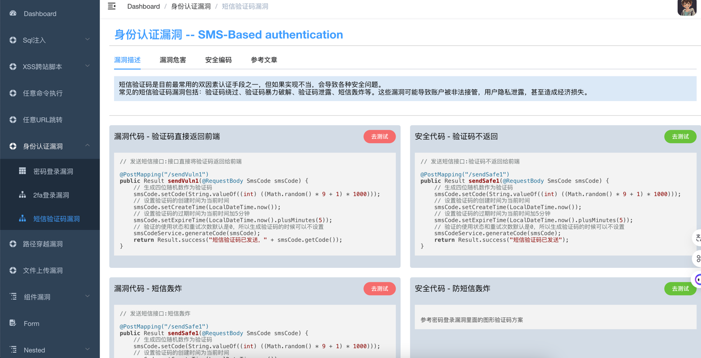
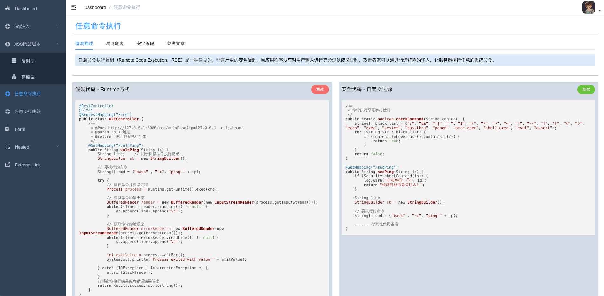
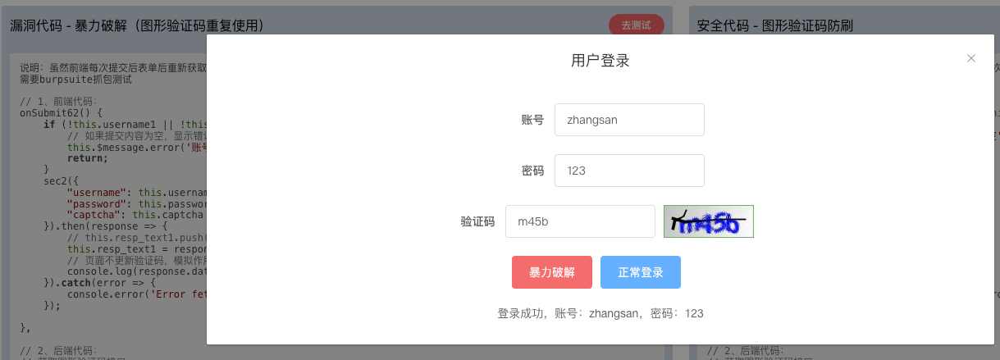
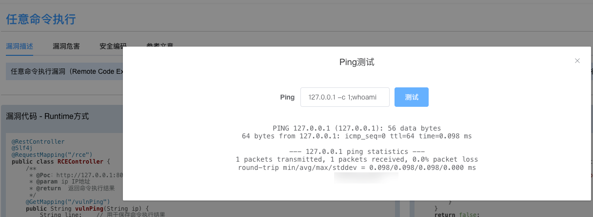
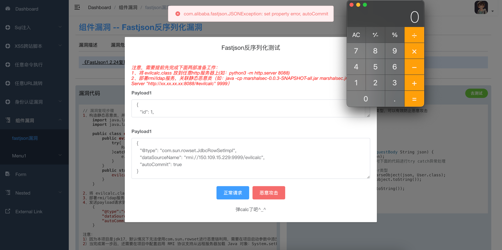
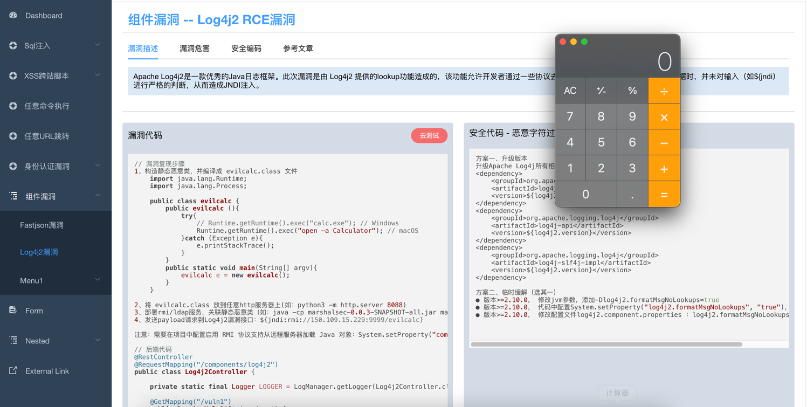
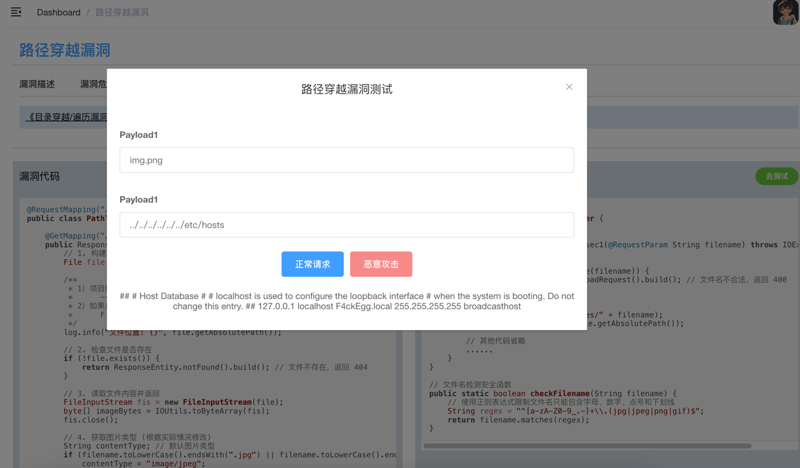
